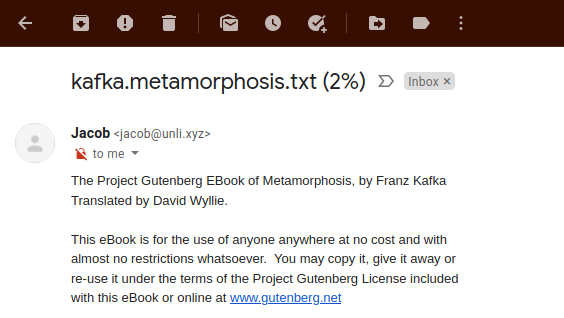

# incremental-book-reading
Send book passages to yourself eight times a week



## Quickstart

### 1) Add books

```
mv -iv samplebooks/ books/
```

#### alternative to 2-4) If you don't like emails then you can just do this:

```
ts-node src/content.ts
```

It works surprisingly fast for ad-hoc use. A few seconds on 80,000 txt files (most of it is typescript transpiling time. If you use this often then just compile it to js and use with node instead of ts-node).

### 2) Configure email address

```
tee src/env.ts
export const env = {
  from: "<fromYou@you.me>",
  to: "Иван Васильевич <toEmail@gmail.ne>",
};
```

### 3) Configure mail transport

You will need your own mail transport :/

You _can_ use Gmail but I prefer to use a local SMTP server. Get more info here: https://nodemailer.com/usage/using-gmail/


### 3b. optional) Configure how often you get emails, how many words per email:

look in `src/schedule.ts` line 15

### 4) Install deps and run

Install deps:

```
yarn
# or npm install
```

Run it like this (and keep it running 24/7 so that it can send the emails)

```
ts-node src/schedule.ts
```

## Test Email

You can test email like this:

```
ts-node src/email.ts
```


## Files

You should convert all your files to plain text.

1) Convert unusual text (be careful when using this on non-english languages)

```
for file in (fd -tf -eTXT pdf --changed-within 1day)
    iconv -t UTF-8//IGNORE "$file" | sponge "$file"
end
```

2) Remove Windows line breaks

```
sed -i 's/\r$//'
```
